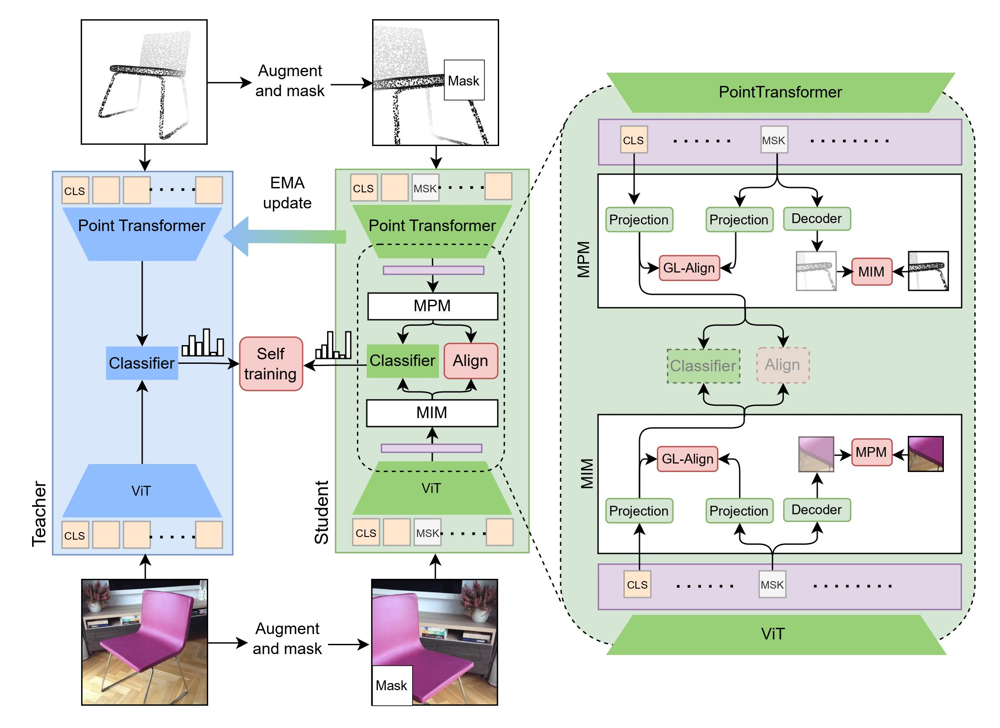

# CrossMoST: Cross-Modal Self-Training: Aligning Images and Pointclouds to learn Classification without Labels

[comment]: <> (---)

Official implementation of [Cross-Modal Self-Training: Aligning Images and Point Clouds to learn Classification without Labels](https://arxiv.org/)

[comment]: <> (---)

# What is CrossMoST
It is an optimization framework to improve the label-free classification performance of a zero-shot 3D vision model by leveraging unlabeled 3D data and their accompanying 2D views. 
We implement a student-teacher framework to simultaneously process 2D views and 3D point clouds and generate joint pseudo labels to train a classifier and guide cross-model feature alignment.
                                                                                                                        
[comment]: <> (---)

# Pipeline


[comment]: <> (---)

# Instructions
## [Install environments]
We trained our models on 4 Nvidia V100 GPUs, the code is tested with CUDA==11.0 and pytorch==1.10.1\
```conda create -n crossmost python=3.7.15``` \
```conda activate crossmost``` \
```conda install pytorch==1.10.1 torchvision==0.11.2 torchaudio==0.10.1 cudatoolkit=11.3 -c pytorch -c conda-forge``` \
```pip install -r requirements.txt```

## [Download datasets and initialize models, put them in the right paths.]
Download the used datasets and initialize models from [here](https://console.cloud.google.com/storage/browser/sfr-ulip-code-release-research). 
For now, you ONLY need to download "modelnet40_normal_resampled", and "shapenet-55".\
The data folder should have the following structure:
```
./data |
-- co3d |
-- modelnet40_rendered |
-- modelnet40_ply_hdf5_2048 |
-- redwood |
-- scanobjectnn |
.
.
-- [dataset].yaml
.
.
-- data_transforms.py 
-- dataset_3d.py 
-- dataset_catalog.json 
-- labels.json 
-- templates.json 
-- utils.py
```
Once you have downloaded and unzipped the datasets, 
```
# Change the data paths in the config files
./data/[dataset].yaml
```
Then, download the [Shapenet-pretrained backbones](https://drive.google.com/file/d/1piD0tWWC9XXtggV1_47WEweDTgTxltx9/view?usp=sharing) and the [DVAE](https://drive.google.com/file/d/1Fh061dVtq6_vzjmgFH2qX72C9y47N1cA/view?usp=sharing) for the point-transformer.

```
./checkpoints |
-- dVAE.pth 
-- ulip-june11-checkpoint_best.pt 
```

## [Zero-shot evaluation of Shapenet-pretrained backbones]
Please change the script to accommodate your system accordingly, this script is used to train on 4 gpus by default. You can also modify the desired output folder in the script.
```
# the scripts are named by its correspoinding 3D backbone name.
bash ./run_zs_eval_modelnet.sh
```
adjust the bash script accordingly to run evaluations for other datasets. 

## [Training CrossMoST]
```
bash ./run_crossmost_train_modelnet.sh
```
You can also run the baseline-self training
```
bash ./run_baseline_train_modelnet.sh
```
adjust the bash script accordingly to run evaluations for other datasets. 

## Checkpoints for evaluating Baseline Self-training vs CrossMoST 
You can download the checkpoints of the CrossMoST and our baselines from [here](https://drive.google.com/drive/folders/1qbWHFsjGDa6F_bcJEo7NNLl-W3MPUnFB?usp=sharing) and put them in the corresponding directories.
```
./checkpoints |
-- dVAE.pth 
-- ulip-june11-checkpoint_best.pt 
-- co3d_baseline |
    -- checkpoint-best.pth |
.
.
.
-- scobjwbg_crossmost |
    -- checkpoint-best.pth
```
To run the evaluation on the provided checkpoints,
```
bash ./run_crossmost_eval_modelnet.sh
```
You can also run the baseline-self training
```
bash ./run_baseline_eval_modelnet.sh
```
adjust the bash script accordingly to run evaluations for other datasets. 

# Acknowledgemets
Our code borrows heavily from [MUST](https://github.com/salesforce/MUST) repository. 
If you use our model, please consider citing them as well.

# Citation
```
@InProceedings{Dharmasiri_2024_CVPR,
    author    = {Dharmasiri, Amaya and Naseer, Muzammal and Khan, Salman and Khan, Fahad Shahbaz},
    title     = {Cross-Modal Self-Training: Aligning Images and Pointclouds to learn Classification without Labels},
    booktitle = {Proceedings of the IEEE/CVF Conference on Computer Vision and Pattern Recognition (CVPR) Workshops},
    month     = {June},
    year      = {2024},
    pages     = {708-717}
```
[//]: # (    @article{xue2022ulip,)

[//]: # (      title={ULIP: Learning Unified Representation of Language, Image and Point Cloud for 3D Understanding},)

[//]: # (      author={Xue, Le and Gao, Mingfei and Xing, Chen and Mart{\'\i}n-Mart{\'\i}n, Roberto and Wu, Jiajun and Xiong, Caiming and Xu, Ran and Niebles, Juan Carlos and Savarese, Silvio},)

[//]: # (      journal={arXiv preprint arXiv:2212.05171},)

[//]: # (      year={2022})

[//]: # (    })

